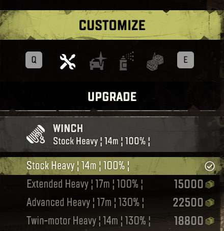

# Reworked "Tires and Cargo Mod Plus"

	&bull; <a href="#en">EN</a> &bull; <a href="#ru">RU</a> 

## EN

**Improved "free" version of "[Tires and Cargo Mod Plus](https://mod.io/g/snowrunner/m/tires-cargo-mod)" / "[Tires Mod Plus without Cargo](https://mod.io/g/snowrunner/m/tires-mod-plus-without-cargo)" mod**

- Fixed the terrain resistance values for the vehicles, because of this there was a "dependency", as well as manual setting of this "dependency".
- Duplicate lines remove
- Changed translation
- Added torque

Anything between the symbol "¦ ¦" is created by the mod. This is done intentionally to specifically indicate changes made by the mod.

<table>
  <tr>
    <td></td>
    <td>
      <ul>
        <li>Torque</li>
      </ul>
    </td>
  </tr>
</table>

<table>
  <tr>
    <td></td>
    <td>
      <ul>
        <li>Tire resistance</li>
      </ul>
    </td>
  </tr>
</table>

<table>
  <caption><strong>Trailer mounting type</strong></caption>
  <tr>
    <td></td>
    <td>
      <ul>
        <li>¦TC¦ - Towbar Car</li>
        <li>¦TT¦ - Towbar Truck</li>
        <li>¦SL¦ - Saddle Low</li>
        <li>¦SH¦ - Saddle High</li>
        <li>¦Tr¦ - Tractor</li>
      </ul>
    </td>
  </tr>
</table>

<table>
  <tr>
    <td></td>
    <td>
      <ul>
        <li>Winches characteristics</li>
      </ul>
    </td>
  </tr>
</table>

<table>
  <tr>
    <td></td>
    <td>
      <ul>
        <li>Cargo: Weight and Space</li>
      </ul>
    </td>
  </tr>
</table>

<table>
  <tr>
    <td>
      
    </td>
    <td style="vertical-align: middle;">Cargo in storage - no overlap</td>
  </tr>
  <tr>
    <td>
      
    </td>
    <td style="vertical-align: middle;">Cargo in storage - with overlap</td>
  </tr>
  <tr>
    <td>
      
    </td>
    <td style="vertical-align: middle;">Cargo in storage - with overlap</td>
  </tr>
</table>

### In the storage zone, the cargo data are overlapped with each other

One solution is to shorten the number of symbol in quotes, e.g:  
`UI_CARGO_BARRELS_NAME "Fuel ¦ 1.5t ¦ 1s ¦"` - there are 21 symbol inside `" "`, the maximum allowed symbol is 25.  
Hence the need to abbreviate words in different languages.

### Why only Windows

I'm not familiar with other platforms, so I won't take responsibility of operability, as the full functionality was tested on Windows.  
You can run the tests yourself, and then write a comment to the module.

### Why is there no weight in the description of the vehicle?

In the game a lot of elements have their own weight, for example, chassis 12 tons, cab 2 tons, wheel 200 kg `(200\*8=1.6 tons)` as a minimum, further: flatbed, tank, etc. and we will get to the mirrors...  
There is no code in the game that will allow dynamic parsing of data that changes when interacting with attachments. That's why I gave up on weight in the description.  
Also, the weight of the same load differs depending on the trailer, so the data on the weight of the load is not accurate.

## RU

**Улучшенная "free" версия мода "[Tires and Cargo Mod Plus](https://mod.io/g/snowrunner/m/tires-cargo-mod)" / "[Tires Mod Plus without Cargo](https://mod.io/g/snowrunner/m/tires-mod-plus-without-cargo)"**

- Исправлены значения проходимости для техники, из-за этого появилась "зависимость", а также ручная установка этой "зависимости".
- Убраны дублирующие строки
- Изменен перевод
- Добавлен крутящий момент

Все что находится между символами "¦ ¦" - создано модом. Это сделано намеренно, чтобы конкретно указать на внесения изменений модом.

<table>
  <tr>
    <td></td>
    <td>
      <ul>
        <li>Крутящий момент</li>
      </ul>
    </td>
  </tr>
</table>

<table>
  <tr>
    <td></td>
    <td>
      <ul>
        <li>Проходимость шин</li>
      </ul>
    </td>
  </tr>
</table>

<table>
  <caption><strong>Типы крепления прицепов</strong></caption>
  <tr>
    <td></td>
    <td>
      <ul>
        <li>¦ФЛ¦ – Фаркоп Легковой</li>
        <li>¦ФГ¦ – Фаркоп Грузовой</li>
        <li>¦СН¦ – Седло Низкое</li>
        <li>¦СВ¦ – Седло Высокое</li>
        <li>¦Т¦ – Трактор</li>
      </ul>
    </td>
  </tr>
</table>

<table>
  <tr>
    <td></td>
    <td>
      <ul>
        <li>Характеристики лебедок</li>
      </ul>
    </td>
  </tr>
</table>

<table>
  <tr>
    <td></td>
    <td>
      <ul>
        <li>Груз: Вес и Место</li>
      </ul>
    </td>
  </tr>
</table>

<table>
  <tr>
    <td>
      
    </td>
    <td style="vertical-align: middle;">Груз на складе — без наложения</td>
  </tr>
  <tr>
    <td>
      
    </td>
    <td style="vertical-align: middle;">Груз на складе — с наложением</td>
  </tr>
  <tr>
    <td>
      
    </td>
    <td style="vertical-align: middle;">Груз на складе — с наложением</td>
  </tr>
</table>

### На складе данные груза накладываются друг на друга

Одно из решений, это сокращение кол-ва символов в кавычках, например:   
`UI_CARGO_BARRELS_NAME "Топливо ¦ 1,5т ¦ 1м ¦"` - внутри `" "` 21 символ, максимально допустимое кол-во 25.   
Следовательно нужно сокращать слова в разных языках.

### Почему только Windows

Я не знаком с другими платформами, поэтому не буду брать на себя ответственность о работоспособности, т.к. полный функционал проверялся на Windows.  
Вы можете сами провести тесты, а после написать комментарий к моду.

### Почему в описании техники нет веса?

В игре множество элементов имеют свой вес, например, шасси 12 тонн, кабина 2 тонны, колесо 200 кг `(200\*8=1,6 тонны)` как минимум, дальше: платформа, цистерна и т.д. и так мы дойдем к зеркалам...  
В игре нет кода, который позволит динамически парсить данные, которые изменяются при взаимодействии с навесным оборудованием. Поэтому я отказался от веса в описании.  
Так же, вес на один и тот же груз отличается взависимости от прицепа, поэтому данные о весе груза не точные.